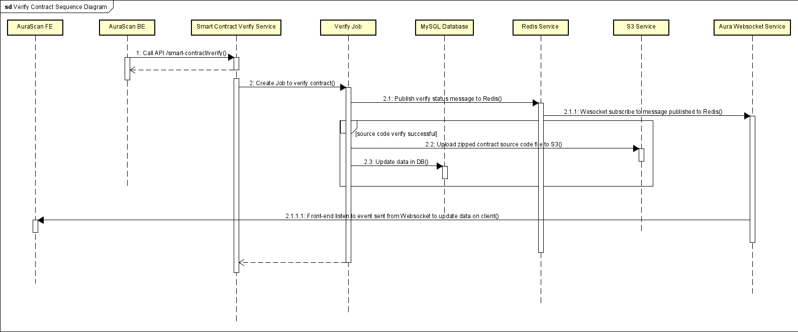

# Verify Smart Contract Application

## Target
Source code verification provides transparency for users interacting with smart contracts. By uploading the source code, AuraScan will match the compiled code with that on the blockchain. Just like contracts, a "smart contract" should provide end users with more information on what they are "digitally signing" for and give users an opportunity to audit the code to independently verify that it actually does what it is supposed to do.

## Method
This project is built following the flow of verifying a smart contract of [CosmWasm documentation](https://docs.cosmwasm.com/docs/1.0/smart-contracts/verify/).

## Main Flow


## Getting started

### 1. Clone the repository.

```bash
git clone https://github.com/aura-nw/verify-contract
```

### 2. Enter your newly-cloned folder.

```bash
cd verify-contract
```

### 3. Create Environment variables file.

```bash
cp .env.example .env
```

### 4. Install dependencies. (Make sure nodejs is installed: https://nodejs.org/en/)

```bash
npm i
```

## Setup for development

Multisignature backend use MySQL and Nodejs. Make sure installed them.

## Running the app

```bash
# development
$ npm run start

# watch mode
$ npm run start:dev
```