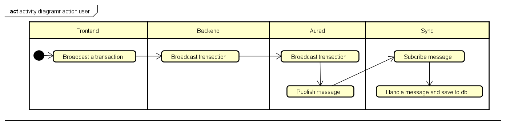
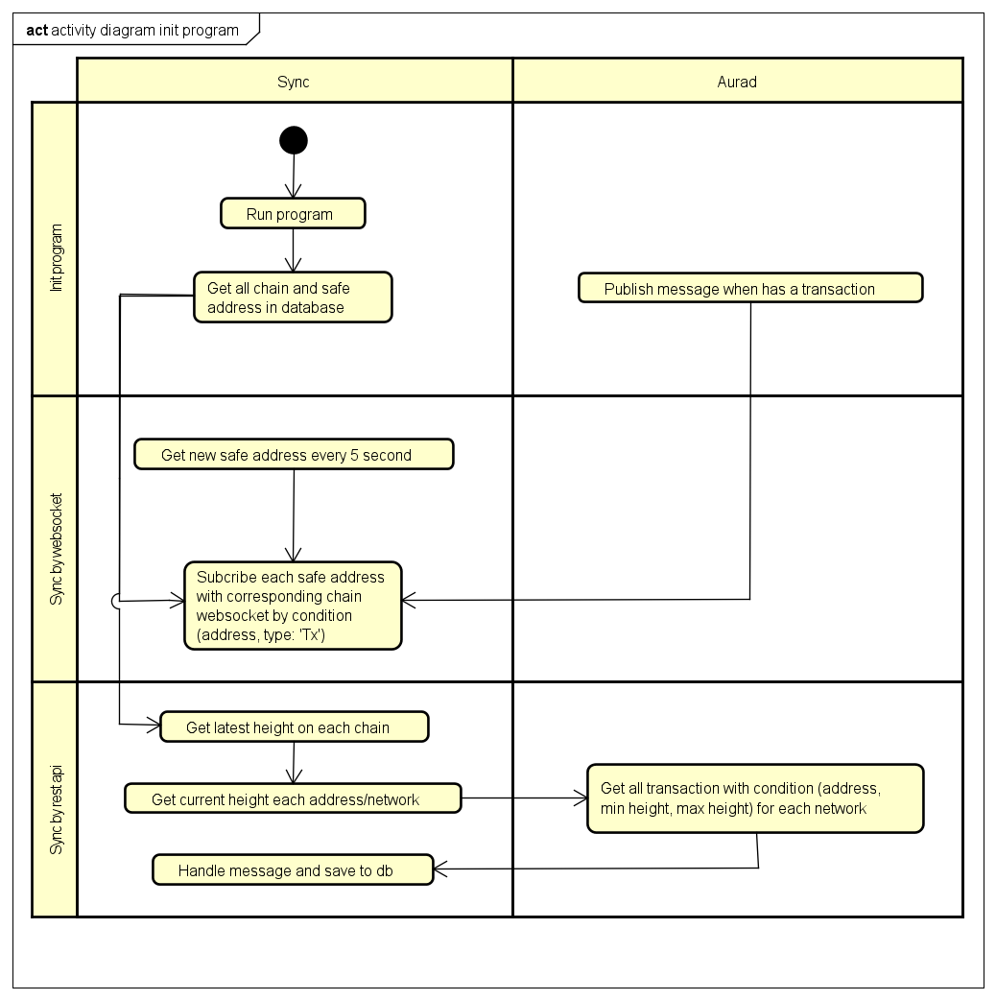

# Main flow

This program will sync transaction from Aura Network to database offchain by websocket. The Tendermint websocket query has params likes:
```
    "tm.event = 'Tx' AND transfer.sender = 'AddrA'"
```
AND
```
    "tm.event = 'Tx' AND transfer.recipient = 'AddrA'"
```

  
1. User action  
When user creates new transaction, Aura network will publish event Tx with transfer.sender or transfer.recipient to subcriber. 

  

2. First run program  
When first run program, program will connect to Aura network and subscribe to event Tx for all safe address. If new safe created, a cronjob run every 5 second will add it to the list address and subcribe for new safe address.  
If this app is crash and restart, program will get current latest block synced in database for each address and latest block in Aura network, then use REST API (Cosmjs) to get all transaction which not synced yet.  


